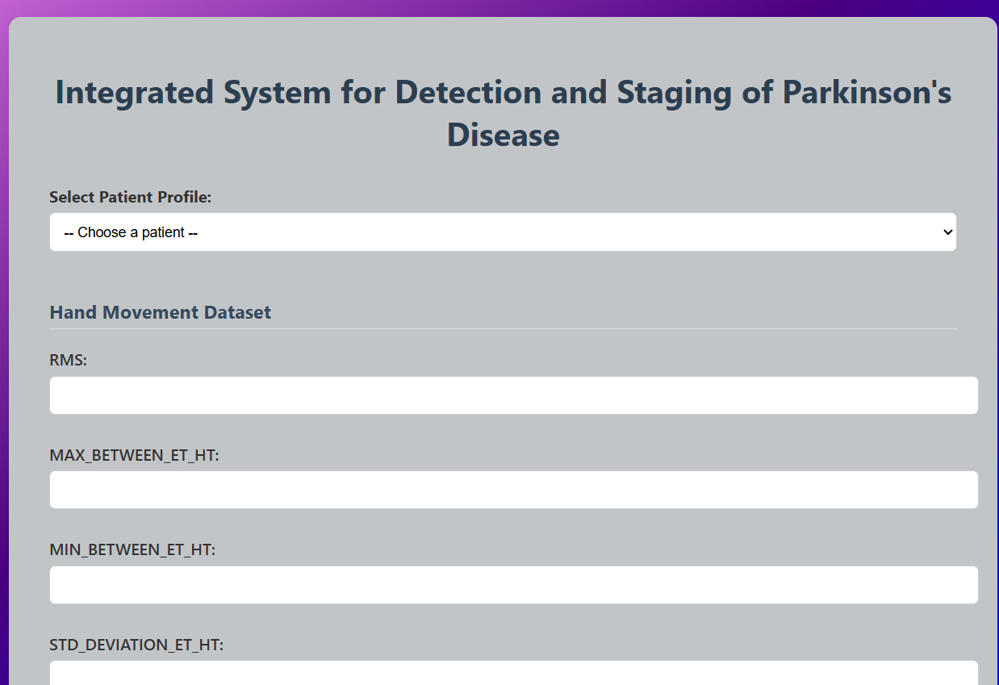

# Parkinson's Disease Detection and Staging

A machine learning-based Streamlit web application that detects Parkinson's Disease and predicts its stage using a trained model.

## Project Overview

This project utilizes a KNN classifier, Decision Tree Model, and Support Vector Machine three machine learning models - trained on biomedical data measurements to detect the presence of Parkinson’s disease in patients and identify its progression stage.

Key functionalities:

- Upload patient input features
- Predict disease presence
- Indicate disease severity or stage
- Easy-to-use web interface powered by Streamlit

---

## 🛠 Tech Stack

- **Frontend**: Streamlit
- **Backend**: Python
- **ML Models**: KNN (K-Nearest Neighbors), DCT (Decision Tree), SVM (Support Vector Machine)
- **Libraries**: `scikit-learn`, `pandas`, `numpy`, `joblib`, `gdown`

---

## Folder Structure

```
📦 Parkinson's-Disease-Detection-And-Staging
├── appp.py                     # Streamlit app script
├── parkinson_knn_model.pkl     # Trained ML model (loaded via gdown)
├── requirements.txt            # Project dependencies
├── README.md                   # Project description
├── templates                   # Contains all html files
└── .gitignore                  # Ignored files
```

---

## 📦 Installation

```bash
git clone https://github.com/deepakkumarsaroj/parkinson-detection-app.git
cd parkinson-detection-app
pip install -r requirements.txt
```

---

## 📥 Model Download

The model is downloaded automatically from Google Drive using `gdown` at runtime.

If not:

```bash
gdown https://drive.google.com/uc?id=1--rgHv5E4qMLeK_0kCODr2jhlCHeDo9b
```

---

## 📸 Screenshots



---

## 🙏 Acknowledgments

- Dataset Source: [UCI ML Repository](https://archive.ics.uci.edu/ml/datasets/parkinsons)
- Model Inspired by academic ML projects on neurological disorders

---

## 🧑‍💻 Author

Made with ❤️ by **Deepak Saroj**  
[GitHub](https://github.com/deepakkumarsaroj)

---
